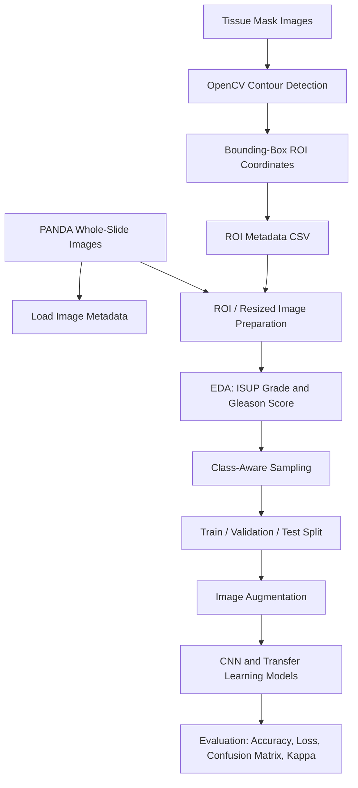

# PANDA Prostate Cancer Grade Classification  
### ROI-Guided Deep Learning for Whole-Slide Histopathology Analysis

<p align="center">
  
  
  
  
  
</p>

## Overview

This repository presents a research-oriented deep learning pipeline for **prostate cancer grade classification** using the **PANDA Challenge dataset**. The project focuses on the practical challenge of working with large-scale whole-slide histopathology images, where cancer-relevant regions are sparse, images are extremely large, and raw slide-level learning can be computationally expensive.

The core idea is to move beyond simple image classification by introducing an **ROI-guided preprocessing workflow**. Tissue mask images are used to locate diagnostically relevant regions, extract bounding-box coordinates, generate structured ROI metadata, and support downstream model training for **ISUP grade prediction**.

This project demonstrates end-to-end skills in medical image analysis, preprocessing pipeline design, exploratory data analysis, transfer learning, model evaluation, and reproducible research engineering.

---

## Why This Project Matters

Prostate cancer grading from biopsy images is a clinically important and technically challenging computer vision problem. Unlike standard natural image datasets, histopathology datasets contain:

- very large whole-slide images,
- high tissue-level heterogeneity,
- sparse diagnostic regions,
- class imbalance across cancer grades,
- annotation noise and slide-level label uncertainty,
- strong dependency on robust preprocessing.

This repository addresses these challenges by combining **mask-driven ROI extraction**, **data balancing**, **image augmentation**, and **deep convolutional classifiers** into a single research workflow.

---

## Key Contributions

- Developed an **OpenCV-based bounding-box ROI extraction pipeline** from tissue mask images.
- Generated structured ROI metadata containing image identifiers and coordinate-level region information.
- Converted Gleason score strings into numerical features for exploratory analysis.
- Analyzed the distribution of **ISUP grades** and **Gleason scores** to understand label imbalance.
- Built a balanced training subset through class-aware sampling.
- Implemented train/validation/test splitting with stratification.
- Designed a Keras/TensorFlow image classification workflow using data augmentation.
- Compared multiple CNN and transfer learning architectures, including:
  - custom CNN baseline,
  - InceptionV3,
  - VGG16,
  - MobileNet.
- Integrated evaluation tools such as accuracy/loss curves, confusion matrix, classification report, and Cohen’s Kappa callback.

---

## Research Pipeline



---

## Dataset

This project uses the **Prostate cANcer graDe Assessment (PANDA) Challenge** dataset from Kaggle.

Expected dataset structure:

```text
prostate-cancer-grade-assessment/
├── train.csv
├── train_images/
│   ├── <image_id>.tiff
│   └── ...
└── train_label_masks/
    ├── <image_id>_mask.tiff
    └── ...
```

The notebooks also support experiments with resized image folders such as:

```text
panda-resized-train-data-512x512/
└── train_images/
    └── train_images/
        ├── <image_id>.png
        └── ...
```

> **Note:** The PANDA dataset is not included in this repository due to licensing and storage limitations. Download it directly from Kaggle and place it under the expected input path.

---

## Notebooks

| Notebook | Purpose |
|---|---|
| `prostrate-cancer-grade-classification.ipynb` | Main research notebook covering ROI extraction, mask processing, EDA, class balancing, augmentation, transfer learning, and model evaluation. |
| `prostate-cancer-classification.ipynb` | Lightweight baseline notebook using a simple CNN on a small image subset for quick experimentation. |

> Recommended repository cleanup: rename `prostrate-cancer-grade-classification.ipynb` to `prostate-cancer-grade-classification.ipynb` to avoid spelling inconsistency.

---

## Methodology

### 1. Mask-Based ROI Extraction

The project uses tissue mask images to identify meaningful regions inside whole-slide images. Contours are detected from grayscale mask images using OpenCV, and bounding boxes are extracted around tissue regions.

Core logic:

```python
contours, _ = cv2.findContours(mask, cv2.RETR_EXTERNAL, cv2.CHAIN_APPROX_SIMPLE)
x, y, w, h = cv2.boundingRect(contours[0])
```

The extracted ROI metadata can be saved as:

```text
image_id, x, y, width, height, roi_base64
```

This creates a bridge between raw WSI data and downstream deep learning models.

---

### 2. Clinical Label Processing

The dataset contains ISUP grade labels and Gleason score strings. The notebooks convert Gleason scores such as `3+4` into numerical form to support statistical exploration.

```python
def convert_gleason_score(score):
    parts = score.split("+")
    return int(parts[0]) + int(parts[1])
```

This enables analysis of the relationship between ISUP grade and Gleason score distribution.

---

### 3. Exploratory Data Analysis

The project includes visual analysis of:

- ISUP grade distribution,
- Gleason score distribution,
- class imbalance,
- correlation between ISUP grade and numerical Gleason score.

These steps are important because class imbalance is a major issue in medical AI, especially when high-risk cancer categories are underrepresented.

---

### 4. Data Sampling and Splitting

To reduce imbalance during experimentation, the notebook samples up to **900 images per ISUP grade** and builds a balanced subset.

The data is then split into:

- training set,
- validation set,
- test set.

Stratified splitting is used to preserve grade distribution across the splits.

---

### 5. Image Augmentation

The training pipeline uses augmentation to improve generalization:

```python
ImageDataGenerator(
    rescale=1./255,
    rotation_range=20,
    width_shift_range=0.2,
    height_shift_range=0.2,
    horizontal_flip=True
)
```

This is especially useful for histopathology images because tissue orientation can vary and clinically relevant patterns should be robust to geometric transformations.

---

### 6. Model Development

The repository explores both baseline and transfer learning models.

#### Baseline CNN

A lightweight CNN is used for quick testing:

```text
Conv2D → MaxPooling → Conv2D → MaxPooling → Flatten → Dense → Dropout → Softmax
```

#### Transfer Learning Models

The main notebook experiments with pretrained ImageNet backbones:

- **InceptionV3**
- **VGG16**
- **MobileNet**

Each model is adapted with a softmax classification head for six ISUP classes.

---

## Evaluation Strategy

The notebooks include the following evaluation components:

- training accuracy,
- validation accuracy,
- training loss,
- validation loss,
- confusion matrix,
- classification report,
- Cohen’s Kappa callback.

Cohen’s Kappa is particularly relevant for medical grading tasks because it evaluates agreement beyond chance and is more informative than accuracy when classes are imbalanced.

---

## Repository Structure

```text
PANDA-Prostate-Cancer-Grade-Classification/
├── README.md
├── notebooks/
│   ├── prostate-cancer-grade-classification.ipynb
│   └── prostate-cancer-classification.ipynb
├── outputs/
│   ├── roi_data.csv
│   ├── training_curves/
│   ├── confusion_matrices/
│   └── model_checkpoints/
├── src/
│   ├── roi_extraction.py
│   ├── preprocessing.py
│   ├── train.py
│   ├── evaluate.py
│   └── utils.py
├── requirements.txt
└── .gitignore
```

---

## Installation

Create a fresh Python environment:

```bash
python -m venv panda_env
source panda_env/bin/activate
```

Install dependencies:

```bash
pip install numpy pandas matplotlib seaborn scikit-learn opencv-python pillow tifffile openslide-python tensorflow keras
```

For Kaggle notebooks, install missing packages directly inside the notebook:

```bash
pip install openslide-python tifffile
```

---

## How to Run

### Step 1: Download the Dataset

Download the PANDA Challenge dataset from Kaggle and arrange the folders as shown above.

### Step 2: Run ROI Extraction

Open the main notebook and execute the ROI extraction cells to generate coordinate metadata.

Expected output:

```text
roi_data.csv
```

### Step 3: Run EDA

Run the ISUP grade and Gleason score analysis cells to inspect class distribution and clinical label patterns.

### Step 4: Train Models

Use the Keras data generator pipeline to train the selected architecture:

```python
history = model.fit(
    train_gen,
    steps_per_epoch=nb_train_steps,
    epochs=nb_epochs,
    validation_data=valid_gen,
    validation_steps=nb_val_steps
)
```

### Step 5: Evaluate

Generate:

- accuracy and loss curves,
- confusion matrix,
- classification report,
- Cohen’s Kappa score.

---

## Current Status

This repository is currently a **research prototype**. It demonstrates a strong foundation for medical image preprocessing and deep learning experimentation, but it is not intended for clinical deployment.

The current version focuses on:

- ROI extraction logic,
- exploratory analysis,
- proof-of-concept classification,
- transfer learning experimentation.

---

## Limitations

- The current experiments use resized images and exploratory notebook workflows.
- Whole-slide images are computationally expensive and require careful memory management.
- Slide-level labels may not perfectly align with extracted local regions.
- More rigorous cross-validation and external validation are needed.
- The current model evaluation should be extended with quadratic weighted kappa, ROC-AUC, macro-F1, and calibration analysis.

---

## Future Research Directions

This project can be extended into a stronger research contribution through:

- multi-instance learning for whole-slide classification,
- attention-based patch aggregation,
- stain normalization,
- artifact filtering,
- tissue segmentation refinement,
- self-supervised pretraining on histopathology patches,
- uncertainty-aware prediction,
- model calibration,
- explainability with Grad-CAM or attention heatmaps,
- cross-center validation across Radboud and Karolinska data sources,
- deployment-ready inference pipeline for large WSI files.

---

## PhD-Relevant Skills Demonstrated

This repository highlights several research skills that are valuable for PhD applications in AI, computer vision, medical imaging, and trustworthy machine learning:

- working with large-scale biomedical image datasets,
- designing preprocessing pipelines for noisy real-world data,
- connecting clinical labels with machine learning targets,
- handling data imbalance,
- building reproducible experiments,
- evaluating classification models beyond accuracy,
- communicating research workflows clearly.

---

## Suggested CV Description

**PANDA Prostate Cancer Grade Classification**  
Developed an ROI-guided deep learning pipeline for prostate cancer grading using whole-slide histopathology images, OpenCV-based tissue mask processing, class-aware sampling, transfer learning, and Keras/TensorFlow model evaluation.

---

## Ethical and Clinical Disclaimer

This project is for research and educational purposes only. The models and outputs are not intended for diagnosis, clinical decision-making, or medical deployment without rigorous validation, expert review, regulatory approval, and clinical safety assessment.

---

## Author

**Hrithik Majumdar Shibu**  
AI/ML Researcher | Computer Vision | Medical AI | NLP  
GitHub: [Shibu4064](https://github.com/Shibu4064)

---

## Acknowledgement

This project is inspired by the PANDA Challenge and the broader medical AI research community working on reliable, interpretable, and scalable computational pathology systems.
